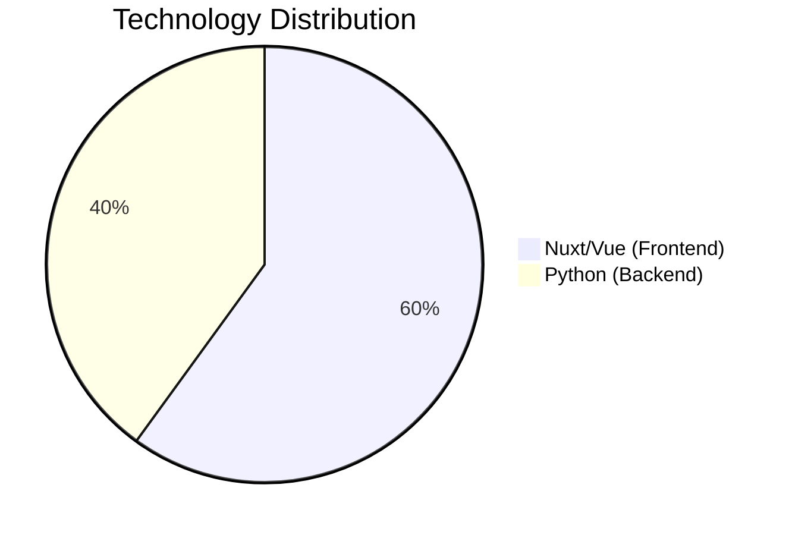

# WildMediaServer

Media server with Nuxt/Vue frontend and Python backend for media management and streaming.

## Technology Stack



_Note: Actual distribution may vary based on configuration. Chart represents approximate codebase focus._

## Prerequisites
- Node.js 16.x+
- Python 3.9+
- PostgreSQL 12+
- Redis 6+
- FFmpeg 4.3+

## Quick Start Guide

### Frontend Setup (Nuxt/Vue)
```bash
# Install dependencies
cd frontend
npm install

# Start development server
npm run dev

# Production build
npm run build
```

### Backend Setup (Python)
```bash
# Create virtual environment
cd backend
python -m venv venv

# Activate environment (Linux/macOS)
source venv/bin/activate

# Activate environment (Windows)
.\venv\Scripts\activate

# Install requirements
pip install -r requirements.txt

# Configure environment
cp .env.example .env
# Edit .env file with your credentials

# Start server
python main.py
```

## System Architecture

```
                          +-----------------+
                          |   Nuxt Frontend |
                          +--------+--------+
                                   |
                          +--------v--------+
                          |  FastAPI/Python |
                          +--------+--------+
                                   |
             +--------------------+--------------------+
             |                    |                    |
     +-------v------+    +--------v--------+    +------v-------+
     |  PostgreSQL  |    |   Redis Cache   |    |  Media Files |
     +--------------+    +-----------------+    +--------------+
```

## Configuration Essentials

### Frontend (.env)
```ini
API_BASE_URL=http://localhost:8000
SSR_HOST=0.0.0.0
SSR_PORT=3000
```

### Backend (config.yaml)
```yaml
database:
  host: localhost
  port: 5432
  name: wildmedia
media_paths:
  - /path/to/media
transcoding:
  output_dir: ./transcoded
  formats: [mp4, webm]
```

## Key Features
- Media browser with thumbnail generation
- Adaptive bitrate streaming
- Multi-user authentication
- Metadata scraping
- Transcoding pipeline

## Maintenance
```bash
# Frontend cleanup
cd frontend && npm run clean

# Rebuild database schema
cd backend && alembic upgrade head

# Clear cache
redis-cli FLUSHALL
```

## Support
For issues and feature requests:  
[Open GitHub Issue](https://github.com/MichaJDev/WildMediaServer/issues)

[](https://buymeacoffee.com/michajanssw)
